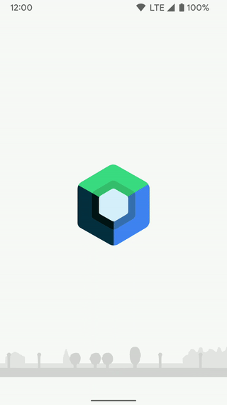
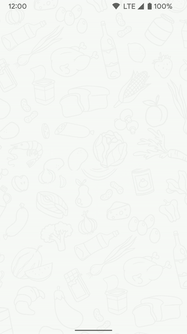
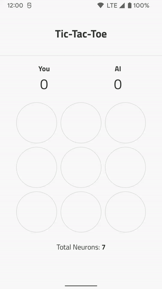
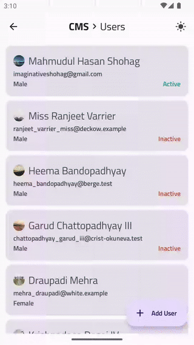
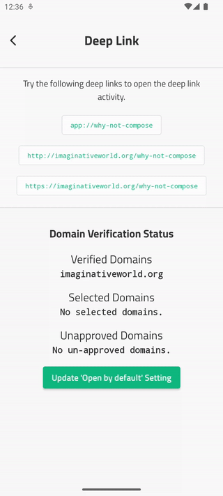

# Why Not Compose!

A collection of animations, compositions, and UIs using Jetpack Compose. You can say Jetpack Compose
cookbook or playground if you want!

Please feel free to ask for features or suggestions for improvements.

[](https://github.com/ImaginativeShohag)
[](https://www.buymeacoffee.com/ImShohag)
[](https://github.com/ImaginativeShohag/Why-Not-Compose/releases)
[](https://play.google.com/store/apps/details?id=org.imaginativeworld.whynotcompose)

[](https://ktlint.github.io/)

## Notable Features & Libraries

- MVI Pattern
- Navigation Component
- Hilt
- Everywhere dark mode support
- A lot of Ready to use compositions
- Material 3
- Gradle Kotlin DSL
- CI/CD
    - ktlint
    - CodeQL
    - Publish to Google Play
- Material 3 examples
- Animated Splash Screen (Introduced in Android 12)

[](https://play.google.com/store/apps/details?id=org.imaginativeworld.whynotcompose)

## Screenshots

### Animations

|  |  |  |
|:---------------------------------------------------------------------:|:-----------------------------------------------------:|:-------------------------------------------------------:|
|                       |                                                       |                                                         |

### Compositions

|           |       |               |
|:---------------------------------------:|:----------------------------------:|:----------------------------------------:|
|         |    |               |
|         |        |  |
|      |     |           |
|            |  |      |
|  |                                    |                                          |

### UIs

|                                    |  |  |
|:-----------------------------------------------------------------------------------------------------:|:---------------------------------------------------------------------------------:|:-------------------------------------------------------------------:|
| <video src="https://github.com/user-attachments/assets/263d712f-1d9a-4e2e-bbf2-e006ab42591a"></video> |                                                                                   |                                                                     |

### Tutorials

- Counter (Beginner)
- Counter with ViewModel (Beginner)
- `AnimatedVisibility` (Beginner)
- Lottie (Beginner)
- Select image and crop for upload (Intermediate)
- Capture image and crop for upload (Intermediate)
- Permission (Beginner)
- Data Fetch and Paging (Advanced)
- Tic-Tac-Toe (Advanced)
- OneSignal and Broadcast (Intermediate)
- ExoPlayer (Advanced)
- CMS (Advanced)
  - Memory and storage caching
- [Deep Link](https://developer.android.com/training/app-links) (Intermediate)
- Navigation Data Pass (Intermediate)
- Reactive Model (Beginner)
- Baseline Profiles (Intermediate)
- [Barcode Scanner](https://developers.google.com/ml-kit/vision/barcode-scanning) ([Google code scanner](https://developers.google.com/ml-kit/vision/barcode-scanning/code-scanner) and [ML Kit Barcode](https://developers.google.com/ml-kit/vision/barcode-scanning/android)) (Intermediate)

|        |                                  |  |
|:-----------------------------------------------------------------------:|:-------------------------------------------------------------------------------------------------------------------------:|:---------------------------------------------------------------:|
|  |                                                  |        |
|  | <video src="https://github.com/user-attachments/assets/71d86d8e-1b4e-4a0d-bf2c-e9bb84bb5d39" style="width:320px"></video> |                                                                 |

# TODO

- Migrate to Material 3
    - [x] CMS
    - [x] Full app
- [ ] Add accompanist WebView
- [ ] x, y, z translation simulation
- [ ] Shadow manipulation with device gyroscope
- [ ] Composition: Bottom Sheet
- [ ] Fix custom `LazyGridScope.items`
- [ ] List with `LazyGrid`
- [ ] Paging with `LazyGrid`
- [ ] Update to new storage permission
- [x] Auto Theme mode from system
- [ ] Create color ready for dark and light mode
- [ ] AlarmManager example
- [ ] Update `CheckBox` code (see example from AOSP)
- [ ] Month-Picker component
- [ ] Upgrade OneSignal lib
- [x] Check map example issue: on click freeze
- [ ] New: File browser using MediaStore
- [ ] Get sidebar from Emudi app (https://www.youtube.com/watch?v=HNSKJIQtb4c)
- [x] Update `popBackStack()`
- [ ] Migrate ExoPlayer: https://developer.android.com/media/media3/exoplayer/migration-guide
- [ ] Update all `LaunchedEffect` with lambda issue using `rememberUpdatedState`: https://developer.android.com/develop/ui/compose/side-effects#rememberupdatedstate
- [ ] Add example for AppColorLocal from Jaber vai
- [x] Update to coil 3
- [ ] Update ktlint

# Note

- For dependency version check I am currently
  using [Gradle Versions Plugin](https://github.com/ben-manes/gradle-versions-plugin#using-a-gradle-init-script)
  . I added this in the Gradle init script and can check versions using the following command.

```bash
./gradlew dependencyUpdates
```

- The project using [spotless](https://github.com/diffplug/spotless/tree/main/plugin-gradle)
  with [klint](https://github.com/pinterest/ktlint). Apply spotless using the following command.

```bash
./gradlew --init-script gradle/init.gradle.kts spotlessApply
```

## Setup

### Map API Key

Open the `local.properties` in your project level directory, and then add the following code.
Replace `YOUR_API_KEY` with your API key.

```groovy
MAPS_API_KEY=YOUR_API_KEY
```

### Go REST API Key

Open the `local.properties` in your project level directory, and then add the following code.
Replace `YOUR_API_KEY` with your [Go REST](https://gorest.co.in) API key.

```groovy
CMS_API_KEY=YOUR_API_KEY
```

## Other Interesting Repos

- [Compose Material Catalog](https://github.com/androidx/androidx/tree/androidx-main/compose/integration-tests/material-catalog)
- [Official Compose Samples](https://github.com/android/compose-samples)
- [Now in Android App](https://github.com/android/nowinandroid)
- [ChrisBanes/Tivi](https://github.com/chrisbanes/tivi)
- [Gurupreet/ComposeCookBook](https://github.com/Gurupreet/ComposeCookBook)
- [spencergriffin/exoplayer-compose](https://github.com/spencergriffin/exoplayer-compose)
- [godaddy/compose-color-picker](https://github.com/godaddy/compose-color-picker)
- [Jetpack Compose Awesome](https://github.com/jetpack-compose/jetpack-compose-awesome)

## Credits

- [Android official compose samples](https://cs.android.com/androidx/platform/tools/dokka-devsite-plugin/+/master:testData/compose/samples/)
- [Iconly icon](https://freebiesbug.com/figma-freebies/iconly/)

## Licence

- **Emudi** is a trademark of [Softzino Technologies](https://softzino.com/).

```
Copyright 2021 Md. Mahmudul Hasan Shohag

Licensed under the Apache License, Version 2.0 (the "License");
you may not use this file except in compliance with the License.
You may obtain a copy of the License at

    http://www.apache.org/licenses/LICENSE-2.0

Unless required by applicable law or agreed to in writing, software
distributed under the License is distributed on an "AS IS" BASIS,
WITHOUT WARRANTIES OR CONDITIONS OF ANY KIND, either express or implied.
See the License for the specific language governing permissions and
limitations under the License.
```
