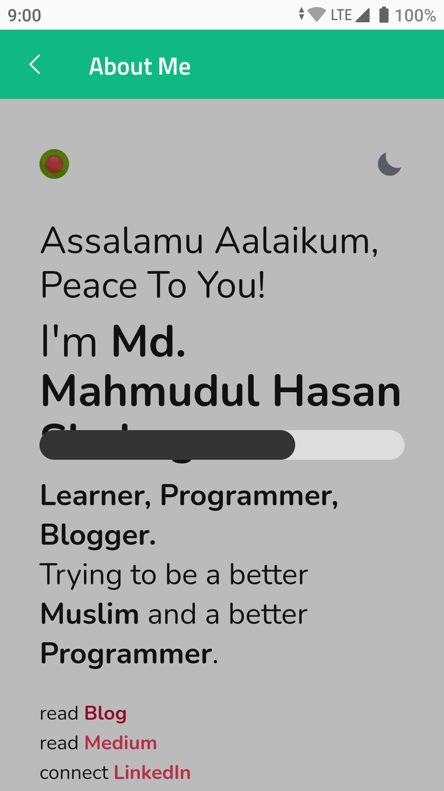

# Why Not Compose!

A collection of animations, compositions, UIs using Jetpack Compose. You can say Jetpack Compose cookbook or play-ground if you want!

Feel free to request features or suggestions for improvements.

## Notable Features & Libraries

- MVI Pattern
- Navigation Component
- Hilt
- Everywhere dark mode support
- A lot of Ready to use compositions
- Gradle Kotlin DSL

## Screenshots


### Animations

|  |  |  |
| :------: | :------: | :------: |

### Compositions

|  |  |  |
| :------: | :------: | :------: |
|  |  |  |
|  |  |  |
|  |  |  |
|  |  |  |

### UIs

|  |  |  |
| :------: | :------: | :------: |

### Tutorials

*Coming soon maybe...*

# TODO

- [x] Gradle Kotlin DSL
- [ ] SwipeToDismiss
- [ ] Spotless

## Setup

### Map API Key

Open the `local.properties` in your project level directory, and then add the following code.
Replace `YOUR_API_KEY` with your API key.

```groovy
MAPS_API_KEY = YOUR_API_KEY
```

## Credits

- [Android official compose samples](https://cs.android.com/androidx/platform/tools/dokka-devsite-plugin/+/master:testData/compose/samples/)
- [Iconly icon](https://freebiesbug.com/figma-freebies/iconly/)
- [spencergriffin/exoplayer-compose](https://github.com/spencergriffin/exoplayer-compose)
- [Loripsum.net](https://loripsum.net)

## Licence

- **Emudi** is a trademark of [Softzino Technologies](https://softzino.com/).

```
Copyright 2021 Md. Mahmudul Hasan Shohag

Licensed under the Apache License, Version 2.0 (the "License");
you may not use this file except in compliance with the License.
You may obtain a copy of the License at

    http://www.apache.org/licenses/LICENSE-2.0

Unless required by applicable law or agreed to in writing, software
distributed under the License is distributed on an "AS IS" BASIS,
WITHOUT WARRANTIES OR CONDITIONS OF ANY KIND, either express or implied.
See the License for the specific language governing permissions and
limitations under the License.
```